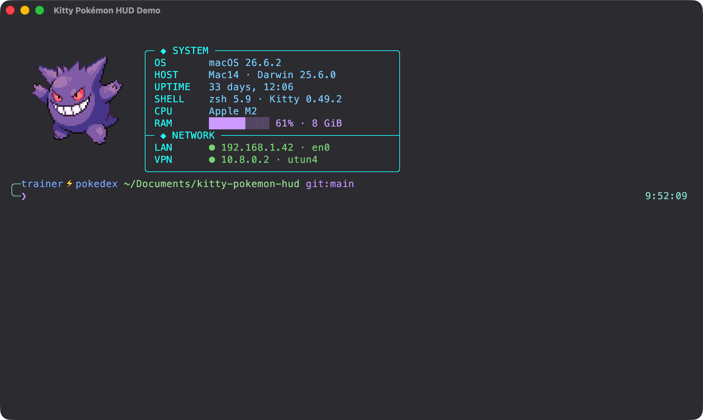
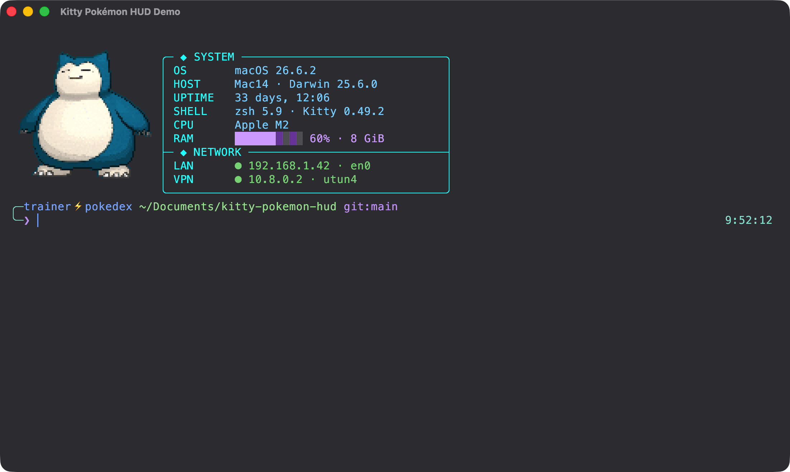
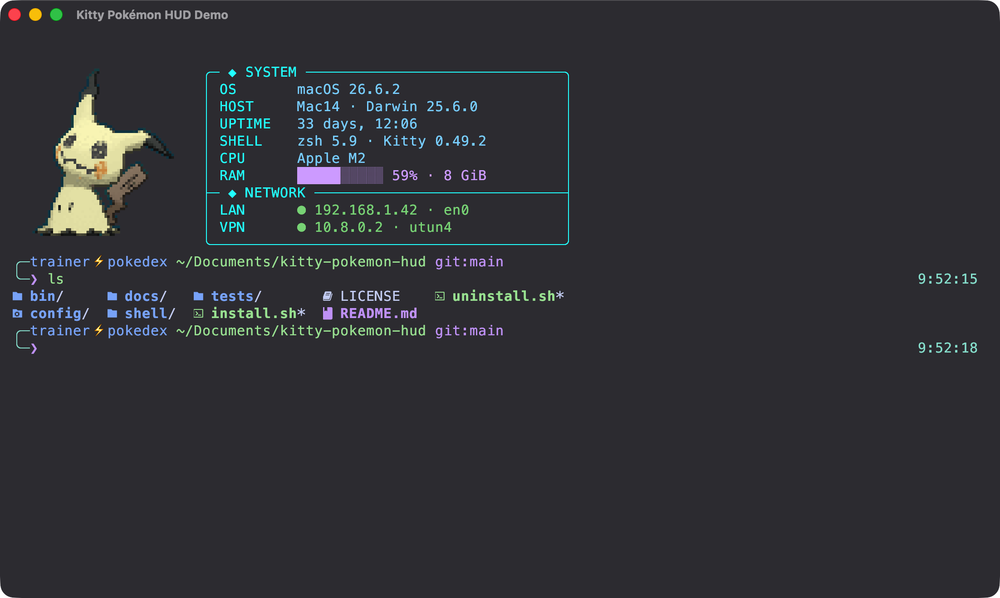

# Kitty Pokémon HUD for macOS

An animated Pokémon companion, compact system/network HUD, colorful file
listing, and polished Zsh prompt for [Kitty](https://sw.kovidgoyal.net/kitty/)
on macOS.

The installer preserves your existing `.zshrc` and `kitty.conf`. It creates
timestamped backups and adds only small, clearly marked integration blocks.



## More previews

| Snorlax dashboard | Mimikyu and colored `ls` |
|---|---|
|  |  |

The screenshots use demonstration addresses and a fictional prompt identity.
No private network data is included.

## Features

- 30 animated Pokémon, randomly selected for every new Kitty window;
- consecutive-repeat protection: the same Pokémon is never selected twice in a row;
- full-frame GIF animation without disappearing body parts or delta-frame artifacts;
- translucent Catppuccin/Tokyo Night-inspired Kitty theme;
- compact `SYSTEM` and `NETWORK` HUD;
- macOS version, Mac model, kernel, uptime, shell, Kitty version, and CPU;
- live RAM usage bar;
- router-assigned LAN address and active VPN `utun` address;
- colorful `eza`-powered `ls` with Nerd Font icons;
- two-line Zsh prompt with Git branch and clock;
- automatic HUD restoration after `clear` and `Ctrl+L`;
- commands for selecting, randomizing, hiding, and restoring Pokémon;
- safe installer, diagnostics, and uninstaller.

## Requirements

- macOS;
- Zsh;
- [Homebrew](https://brew.sh/);
- internet access during the first installation.

The installer automatically installs Kitty, ImageMagick, `eza`, and the Meslo
Nerd Font when they are missing.

## Quick installation

```bash
git clone https://github.com/Rezekgames1/kitty-pokemon-hud.git
cd kitty-pokemon-hud
./install.sh
```

Then open a new Kitty window or reload Zsh inside Kitty:

```bash
exec zsh
```

Building all 30 animations may take a few minutes on the first run. After that,
the terminal starts entirely from the local cache and does not require network
access.

## What the installer changes

1. Verifies macOS and Homebrew.
2. Installs `kitty`, `imagemagick`, `eza`, and Meslo Nerd Font if necessary.
3. Installs the runtime under `~/.config/pokemon-terminal/`.
4. Creates `~/.config/kitty/pokemon-hud.conf`.
5. Adds one managed `include` block to `~/.config/kitty/kitty.conf`.
6. Adds one managed `source` block to `~/.zshrc`.
7. Downloads 30 source animations and builds artifact-free full-frame GIFs locally.

Before modifying your configuration, the installer creates a backup under:

```text
~/.config/kitty-pokemon-hud-backups/YYYYMMDD-HHMMSS/
```

The installer is idempotent. Running it again updates the installation without
duplicating lines in `.zshrc` or `kitty.conf`.

## Included Pokémon

```text
gengar       pikachu      charmander   bulbasaur    squirtle
eevee        meowth       psyduck      snorlax      jigglypuff
growlithe    abra         cubone       machop       haunter
dragonite    mew          mewtwo       chikorita    cyndaquil
totodile     umbreon      espeon       mudkip       torchic
treecko      riolu        lucario      mimikyu      rowlet
```

## Commands

```bash
# List all installed Pokémon
pokemon-list

# Select a specific Pokémon
pokemon lucario
pokemon gengar

# Select another random Pokémon without repeating the previous one
pokemon-random

# Hide the image
pokemon-stop

# Restore the current image
pokemon-start

# Redraw the complete dashboard
pokemon-dashboard

# Clear the terminal and automatically restore the dashboard
clear
```

`Ctrl+L` behaves like the customized `clear` command.

## Customization

### Transparency and colors

Edit:

```text
~/.config/kitty/pokemon-hud.conf
```

The main transparency setting is:

```conf
background_opacity 0.88
```

The recommended range is `0.82–0.94`. Background blur is deliberately disabled:
on macOS, blur can produce a visible rectangle around Kitty graphics-protocol
images.

Open a new Kitty window after changing Kitty settings.

### Pokémon size and dashboard placement

Edit:

```text
~/.config/pokemon-terminal/config
```

Default values:

```bash
POKEMON_WIDTH=20
POKEMON_HEIGHT=10
POKEMON_LEFT=1
POKEMON_TOP=1
DASHBOARD_INFO_LEFT=23
DASHBOARD_INFO_TOP=2
DASHBOARD_PROMPT_TOP=13
```

Run `clear` after changing dashboard placement.

### File colors

The `EZA_COLORS` palette and the `ls`, `ll`, and `la` aliases are defined in:

```text
~/.config/pokemon-terminal/pokemon-terminal.zsh
```

By default, directories are blue, executables green, Python files yellow,
archives red, configuration files cyan, and Markdown/PHP files purple.

### Demo mode

For screenshots or presentations, the dashboard can show safe example network
addresses instead of real ones:

```bash
POKEMON_HUD_DEMO=1 \
POKEMON_HUD_PROMPT_USER=trainer \
POKEMON_HUD_PROMPT_HOST=pokedex \
kitty
```

Demo mode displays `192.168.1.42` and `10.8.0.2`. It is disabled by default.

## Diagnostics

Run:

```bash
~/.config/pokemon-terminal/doctor.sh
```

If the Pokémon does not appear:

```bash
echo "$TERM"
echo "$KITTY_WINDOW_ID"
~/.config/pokemon-terminal/doctor.sh
clear
```

Expected values are `TERM=xterm-kitty` and a non-empty `KITTY_WINDOW_ID`.

When no VPN tunnel is active, the HUD displays `VPN ● offline`. The first active
`utun` interface with an IPv4 address is treated as the VPN interface.

## Updating

```bash
cd kitty-pokemon-hud
git pull --ff-only
./install.sh
exec zsh
```

To rebuild every animation from scratch:

```bash
~/.config/pokemon-terminal/install-sprites.sh --force
```

## Uninstalling

From the cloned repository:

```bash
./uninstall.sh
```

The uninstaller removes only the managed integration blocks and Kitty Pokémon
HUD files. Homebrew dependencies and timestamped backups are preserved.

## Advanced installation options

Skip Homebrew dependency installation when everything is already installed:

```bash
./install.sh --skip-deps
```

Install the integration without downloading animation assets:

```bash
./install.sh --skip-deps --skip-assets
```

## Project layout

```text
bin/                         Runtime scripts and diagnostics
config/                      Kitty theme and dashboard defaults
shell/                       Zsh integration
docs/screenshots/            Sanitized real Kitty screenshots
tests/static.sh              Syntax and isolated installer tests
install.sh                   Idempotent installer
uninstall.sh                 Safe uninstaller
```

## Credits and legal notice

- Terminal: [Kitty](https://sw.kovidgoyal.net/kitty/)
- Animated sprites: [Project Pokémon](https://projectpokemon.org/)
- Pokémon terminal inspiration: [acxz/pokeshell](https://github.com/acxz/pokeshell)
- Icons: [Nerd Fonts](https://www.nerdfonts.com/)

Pokémon sprites are not stored in this repository. They are downloaded directly
from Project Pokémon during installation. Pokémon and all related names belong
to their respective rights holders. The project source code is distributed
under the MIT License.
